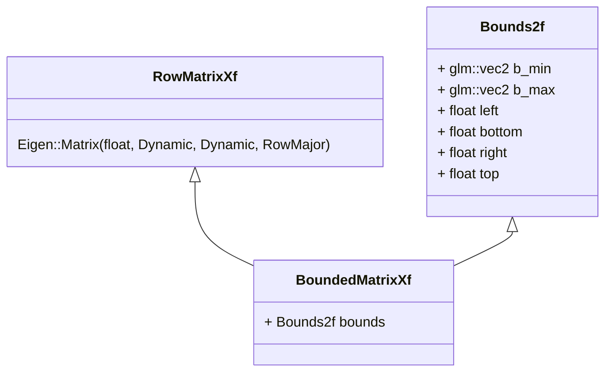

# BoundedMatrixXf 类图

## 类图说明

### Bounds2f 类
- **成员变量**
  - `b_min` 和 `b_max`：类型为 `glm::vec2`，表示边界的最小和最大点
  - `left`、`bottom`、`right`、`top`：分别表示矩形区域的左、下、右、上边界的坐标

### RowMatrixXf 类
- Eigen的行优先存储动态矩阵
- 元素类型为float
- 行列数在运行时确定

### BoundedMatrixXf 类
- **继承关系**
  - 继承自 `RowMatrixXf`（行优先存储的Eigen矩阵）

- **成员变量**
  - `bounds`：类型为 `Bounds2f`，表示矩阵的二维边界