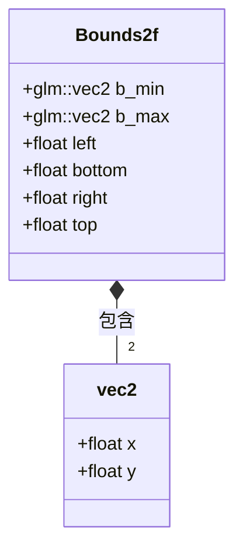

# Bounds

是的，`bounds` 是 `bound` 的复数形式。在计算机图形学中，`bounds` 通常表示一个边界区域，包含：
- 最小边界（lower bound）
- 最大边界（upper bound）

比如在2D中，`Bounds2f` 通常包含：
- 最小点 (x_min, y_min)
- 最大点 (x_max, y_max)

这就是为什么使用复数形式 `bounds`，因为它描述了一个由多个边界点定义的区域。

相关用法示例：
```cpp
Bounds2f bounds;  // 正确，表示一个边界区域
bounds.min;       // 最小边界点
bounds.max;       // 最大边界点

// 而不是
Bound2f bound;    // 不太准确，因为一个边界区域需要多个边界点来定义
```

# Phoenix::Bounds2f
 
`Bounds2f` 是一个表示2D轴对齐边界框(AABB)的类，使用 GLM 库实现。

## 类图


## 主要特点
- 使用 GLM 库的 vec2 类型
- 支持两种坐标表示方式（通过 union 实现）：
  - 最小/最大点表示 (b_min/b_max)
  - 左下右上表示 (left/bottom/right/top)
- 提供默认构造函数，初始化为一个"空"边界框

## 构造函数
- **默认构造函数**: 创建一个"空"边界框，最小值设为最大浮点数，最大值设为最小浮点数
- **点对构造**: 通过最小点和最大点构造
- **边界构造**: 通过左、下、右、上四个值构造
