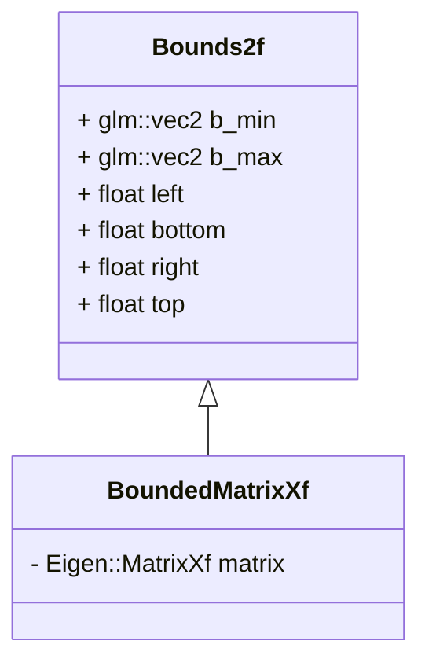

# BoundedMatrixXf 类图

## 类图说明

### Bounds2f 类
- **成员变量**
  - `b_min` 和 `b_max`：类型为 `glm::vec2`，表示边界的最小和最大点
  - `left`、`bottom`、`right`、`top`：分别表示矩形区域的左、下、右、上边界的坐标

  > 注：这些成员变量通过 `union` 和 `struct` 的组合来实现，以便在不同的上下文中使用不同的表示方式

### BoundedMatrixXf 类
- **成员变量**
  - `matrix`：类型为 `Eigen::MatrixXf`，用于存储测量数据
- **继承关系**
  - 继承自 `Bounds2f` 类